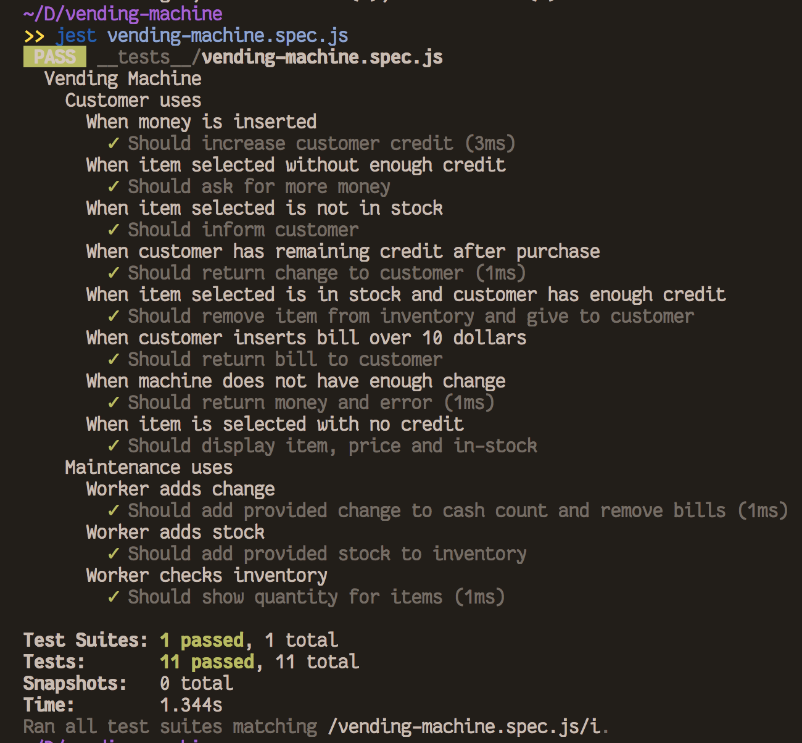

# A Vending Machine

ADP Summer 2018, Adam Roerick

## What is it?

_Do you actually not know what a vending machine is?_

- Put in money, it gives you the thing you requested. 

- Use a or b to select row, 0 or 1 to select slot. Not a large vending machine.

Most importantly was created with a Test Driven Developement approach. Tests were written from the perspective of someone interacting with the vending machine and that user's expected result. 

__Just look at all those green ticks__

## The Techs
- Written in js
- Tested with jest

## For use at home

> __Dowload the repo__  
> __npm install__  
> __jest vending-machine.spec.js__ to run tests